# Mastering Continuous Integration with Jenkins

**Building a Pipeline with Jenkins** involves setting up an automated process for continuous integration and delivery. Start by installing Jenkins and creating a new Pipeline job. Use the `Jenkinsfile` to define the stages of your pipeline, including code checkout, build, test, and deployment. Leverage Jenkins plugins to integrate with various development, testing, and deployment tools. Finally, trigger your pipeline through source code changes or schedule it to ensure your application is always up-to-date and stable.

## Check jenkins status (Windows OS)

To check if Jenkins is running on Windows using Resource Monitor, follow these simple steps:

1. **Open Resource Monitor**: Press `Windows Key + R` to open the Run dialog, type `resmon`, and press Enter.

2. **Navigate to the Network Tab**: In Resource Monitor, go to the `Network` tab to view network activity.

3. **Filter by Process**: Look for `java.exe` or the specific process name if Jenkins runs as a service with a different name. You might need to know the exact process name Jenkins uses on your system.

4. **Check Listening Ports**: Under the `TCP Connections` section, you can see which ports are being used by the Jenkins process. Jenkins typically listens on port 8080 by default, unless configured otherwise.

5. **Verify Jenkins Activity**: If you see the Jenkins process (`java.exe` or another) using the expected port (e.g., 8080), Jenkins is running. If not, you might need to start the Jenkins service or investigate further.
   
   

This method provides a quick way to verify Jenkins' operational status and its network activity on a Windows system.

## Build a new job

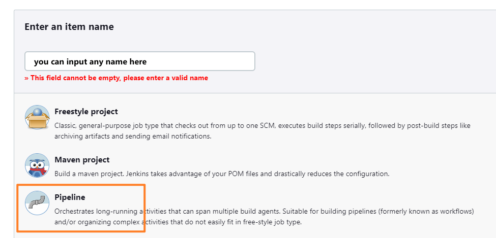

There are multiple ways to create a pipeline. I choose the easiest one which is to create a Jenkinsfile and store it in your SCM(here is GitHub). Then choose pipeline from SCM. Tell your link that jenkins can get all your jenkins code automatically for you.

## Setup Jenkins

Details in Jenkinsfile.

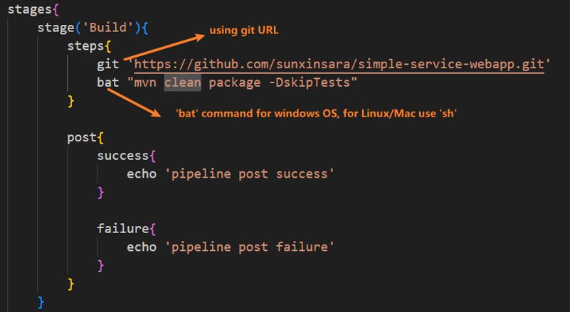

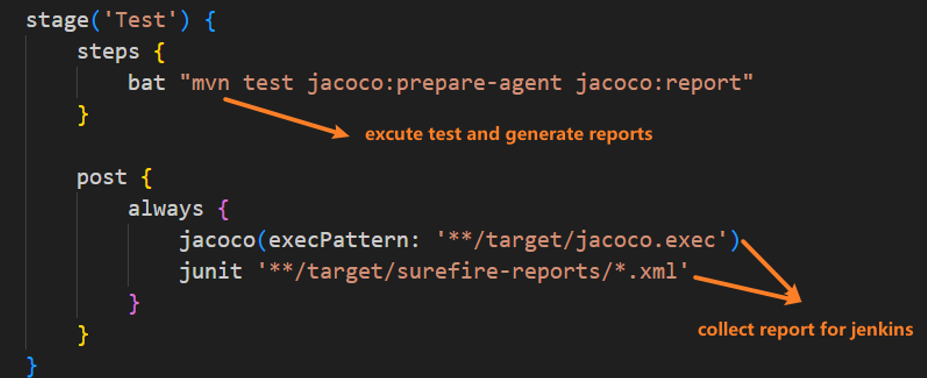

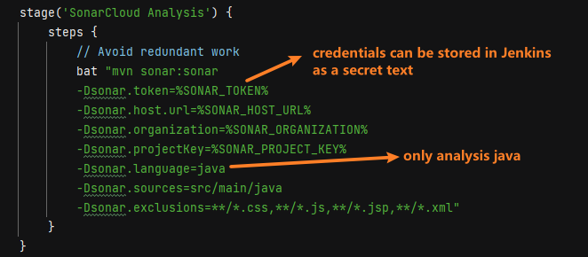

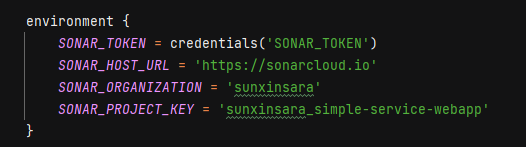

## Stage view

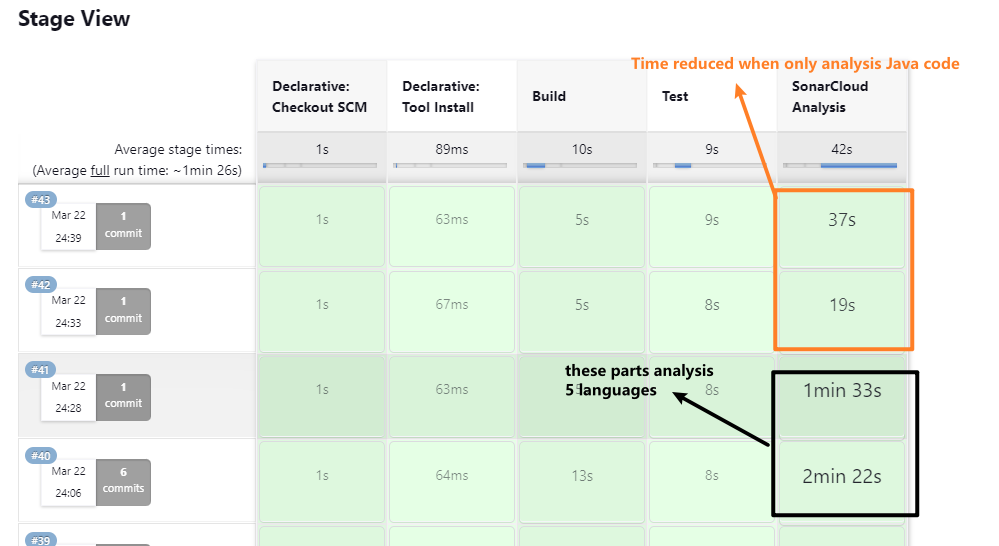

## Build result

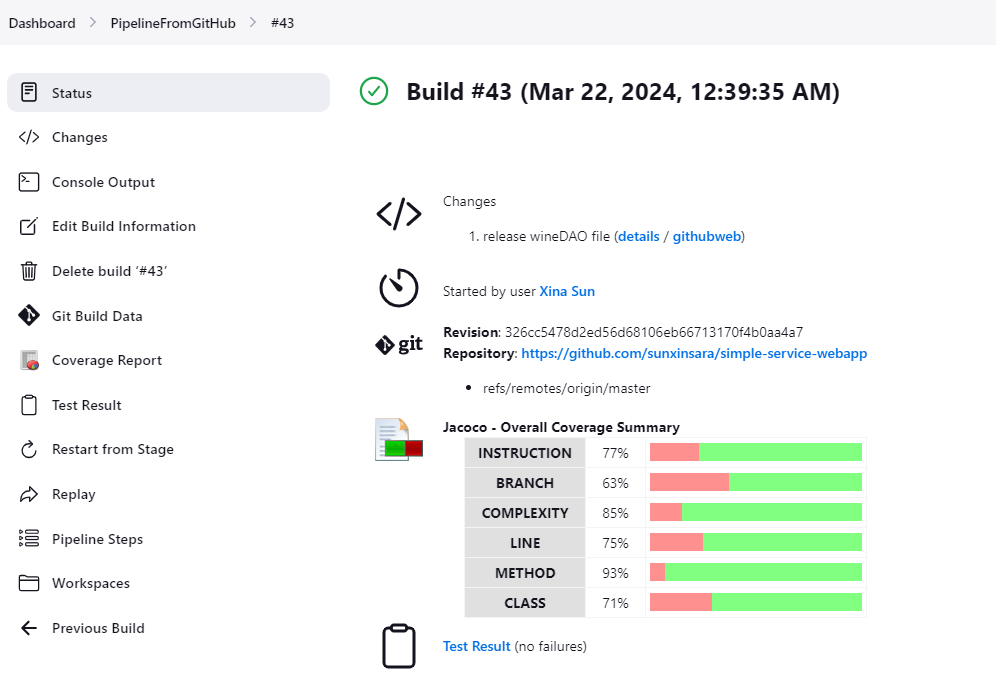

## Get your archieve file

Workspaces => target

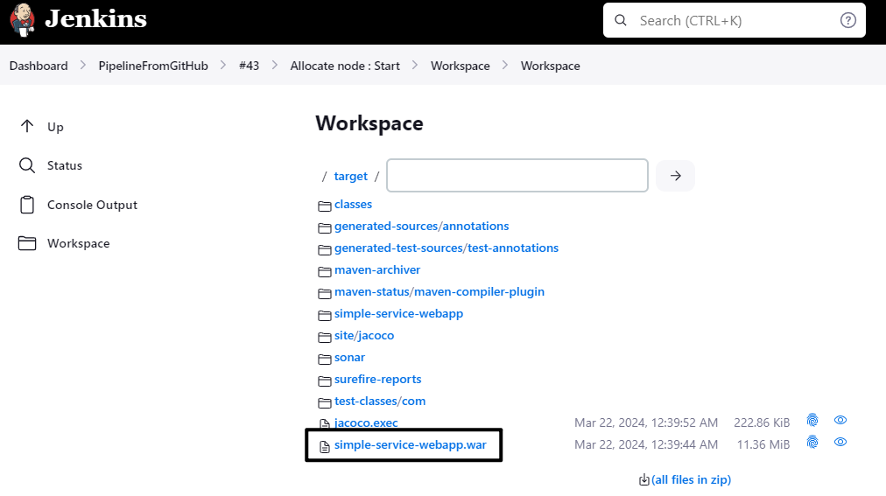

## Coverage View in Jenkins

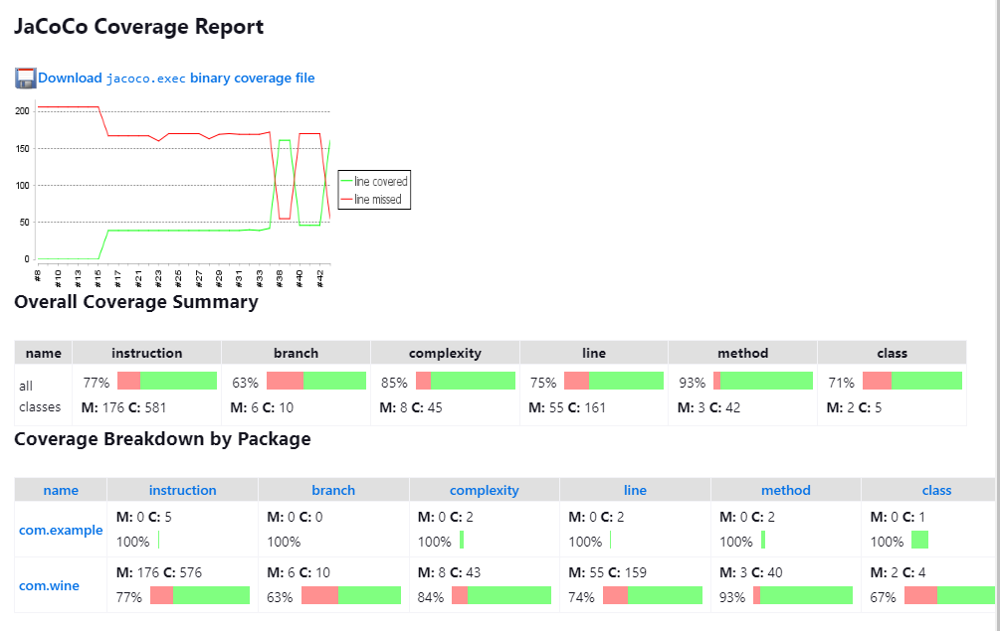

## Test Result

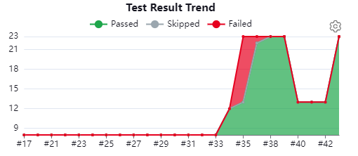

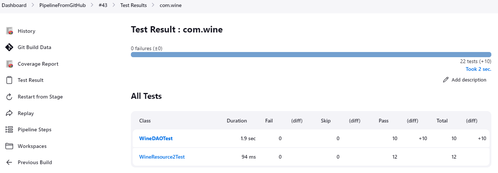
