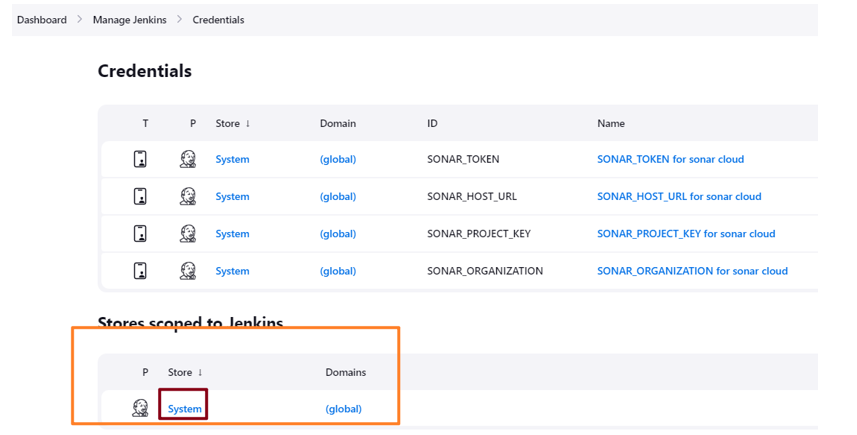

# SonarCloud

SonarCloud is a cloud-based service that provides continuous inspection of code quality to perform automatic reviews with static analysis of code to detect bugs, code smells, and security vulnerabilities. It supports a wide range of programming languages and integrates seamlessly with GitHub, Bitbucket, and GitLab, as well as continuous integration tools. By scanning your codebase, SonarCloud offers detailed reports on the health of your application, highlighting issues that need attention. It is designed to enhance code quality and security, making it an essential tool for developers aiming to maintain high standards in their projects. SonarCloud facilitates easy tracking of code quality over time, helping teams to identify and address issues early in the development process.

In SonarCloud, the code quality issues are categorized into bugs, code smells, vulnerabilities, and security hotspots:

- **Bugs** are errors in code that cause the program to behave unexpectedly or crash. For example, a division by zero or a null pointer dereference.

- **Code Smells** are not errors, but indicators of poor code design that may make the code hard to maintain or extend. An example would be a method that's too long, making it difficult to understand.

- **Vulnerabilities** are weaknesses in the code that could be exploited to compromise system security, data integrity, or availability. An example is SQL Injection, where attackers can execute malicious SQL code through a web application.

- **Security Hotspots** are areas in the code that need to be reviewed to prevent potential vulnerabilities. They are not necessarily vulnerabilities themselves but are sensitive areas that might be exploitable. For instance, the use of encryption without proper validation could be a security hotspot, as it might lead to insecure cryptographic practices.

*an example of code smell*

## Connect SonarCloud with Jenkins

To connect SonarCloud with Jenkins, start by generating an authentication token in SonarCloud. Navigate to your SonarCloud account settings, select 'Security', and create a new token. Name it appropriately so you can identify its purpose later. Once the token is generated, copy it for later use.

Next, switch to Jenkins. In Jenkins, you'll need to store this token securely. Go to 'Manage Jenkins', then 'Manage Credentials'. Choose the domain where you'd like to add the token, or create a new one if necessary. Click on 'Add Credentials'. Select the 'Secret text' type for the credential kind, and paste the SonarCloud token you previously copied into the 'Secret' field. Give it an ID and description to help identify its use within Jenkins.

Click system.

Click Global credentials

Click button "Add Credentials"

Select secret text

Paste SonarCloud token in the secret area.

When you need to use SonarCloud token, you can get this value through credentials.

