# Integrating Git with IntelliJ IDEA and Basic Operations

IntelliJ IDEA is a powerful IDE that supports integration with Git, allowing developers to manage version control for their projects directly within the IDE. This guide covers the basic steps to integrate Git with IntelliJ IDEA and how to perform essential Git operations such as committing changes and updating projects.

## Integrating Git with IntelliJ IDEA

1. **Ensure Git is Installed**: Before integrating Git with IDEA, make sure Git is installed on your computer. You can download it from [git-scm.com](https://git-scm.com/).

2. **Configure Git in IDEA**: Open IntelliJ IDEA and navigate to `File` -> `Settings` (on Windows and Linux) or `IntelliJ IDEA` -> `Preferences` (on macOS). Go to `Version Control` -> `Git`. Click the `...` button next to the `Path to Git executable` and select the path to the Git executable on your computer, usually `C:\Program Files\Git\bin\git.exe` on Windows or `/usr/bin/git` on Linux and macOS.
   
   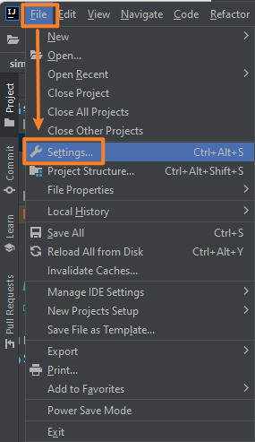
   
   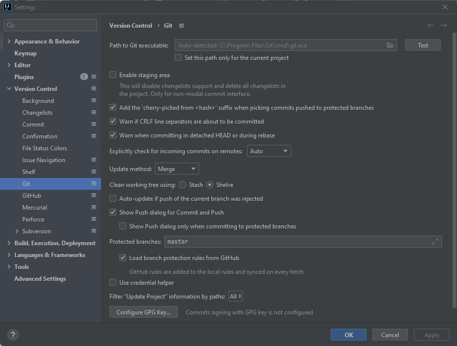

## Create a Git repository

The traditional way to initiate a new git repository is to use command ‘git init’. Another way to initiate. Using GitHub create a repository, then clone to your local machine.

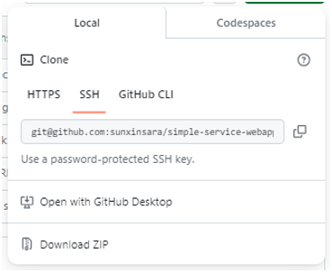

## Committing Changes with Git in IntelliJ IDEA

As for Making commits, you can use git command with git bash. Or using your IDE, nowadays, most IDE have already integrated git. I am using IDEA IntelliJ, with this tool you can see the picture as below. 

1. **Make Changes**: Make changes to your project files.

2. **Open the Commit Window**:
   
   - Navigate to `VCS > Commit` (or use the shortcut `Ctrl+K` on Windows/Linux, `Cmd+K` on macOS).

3. **Select Files to Commit**: In the Commit window, select the files you want to commit. You can also enter a commit message describing the changes.
   
   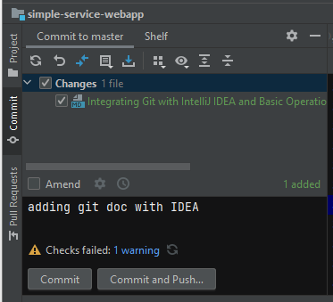

4. **Commit Changes**:
   
   - Click the `Commit` button (or `Commit and Push` if you want to immediately push the changes to a remote repository).
     
     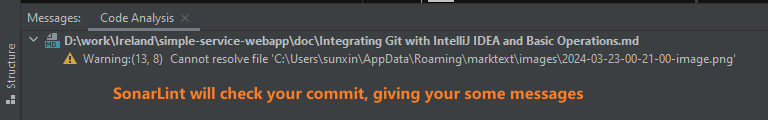

If you want to ingore this warning, you can choose commit anyway.

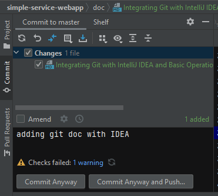

When you successfully commit, you can see your commit in log pan.

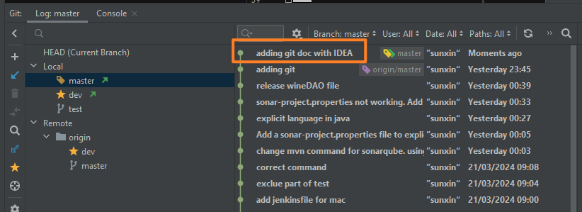

## Create a branch

In the IDE, the visualized git tool pan, you can easily find the plus symbol to create a new branch.

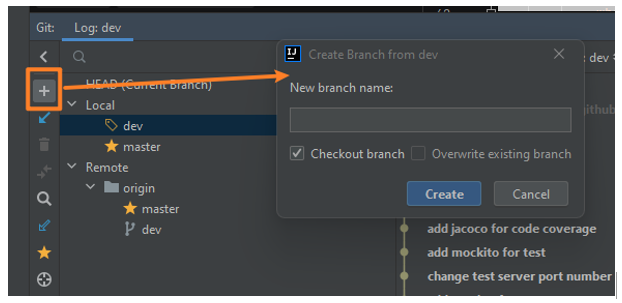

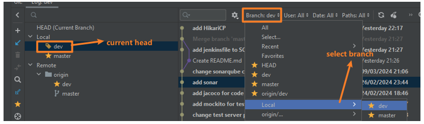

## Merge branches

Add a commit in test branch

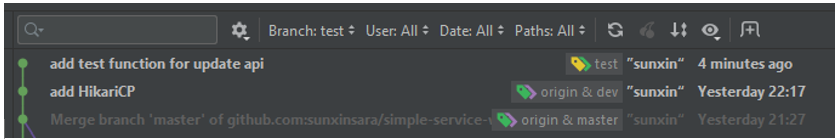

Go back to master branch by clicking the branch choice.
Go to the top menu bar. Find Git -> Merge.

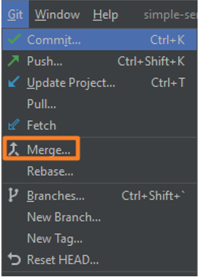

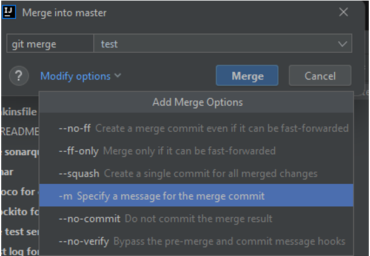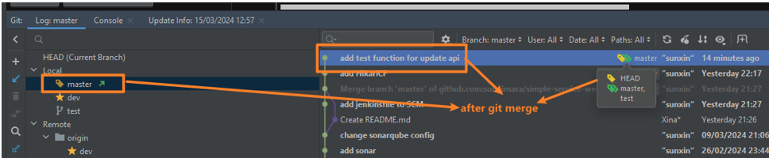

## Handle merge conflicts

Conflicts in Git occur when multiple changes are made to the same part of a file in different branches or commits and Git is unable to automatically merge them. This usually happens when two developers are working on the same codebase and make different changes to the same lines of code or when a developer's local branch diverges significantly from the branch they are trying to merge into or rebase onto.

### Simulate a local merge conflict.

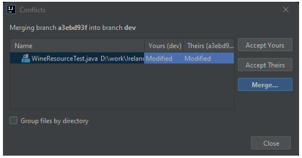

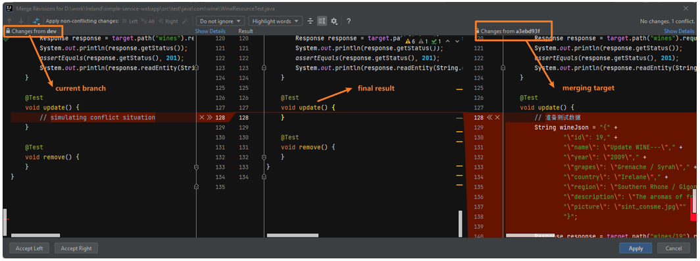

Click the alpply button and confim your changes.

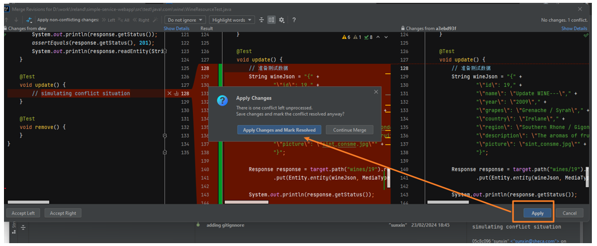

After merge check dev branch log.

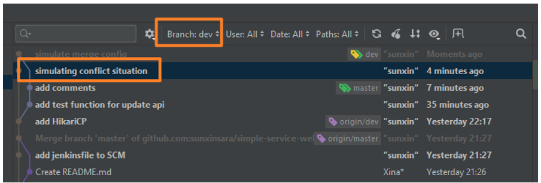

### Simulate a pull request merge conflict.

Simulate a conflict in branch test and testConflict. Edit same line, the password line.

Then push all these changes to GitHub.

Create a pull request to merge test branch into testconflict branch. You will see the warnning that GitHub can not automaically merge because of the conflict.

You need to resolve the conflict manully. Click the button "Resolve conflicts".

You will enter to the page showing your difference in those two branches.

Edit the code then click the button "Mark as resolved"

Then commit merge.

Congras, here you have already reolved the conflicted. 

## Updating Project with Git in IntelliJ IDEA

1. **Fetch Changes**:
   
   - To fetch the latest changes from the remote repository, go to `VCS > Git > Fetch`.
     
     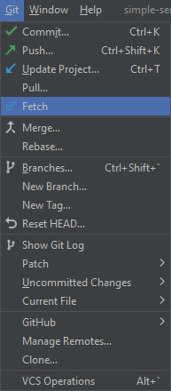

2. **Pull Changes**:
   
   - To merge the latest changes into your current branch, navigate to `VCS > Git > Pull`.
   - In the dialog that appears, select the remote branch you want to pull changes from and click `Pull`.

Integrating Git with IntelliJ IDEA streamlines version control, making it easier to manage project changes, commit new code, and keep up with the latest updates from your team. This integration enhances productivity and ensures a smoother development process.
