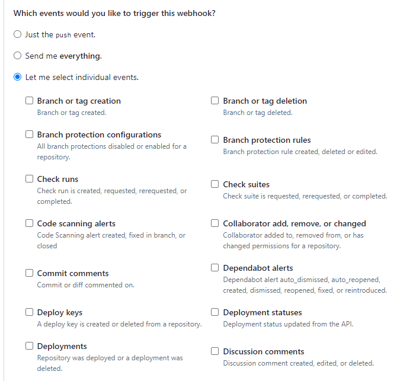

# Knowing Triggers in Jenkins

Triggers is a concise overview of the automated mechanisms that initiate builds in Jenkins, a prominent automation server. Triggers are essential for automating workflows, responding to events like code changes, pull requests, or timed schedules. This guide helps users understand and configure these triggers to enhance efficiency in continuous integration and delivery processes.

When you open the pipeline job settings can find the part.

There are different options:

1. **Build after other projects are built**: Triggers this build after specified projects are successfully built.
2. **Build periodically**: Schedules the build to run at specific intervals, regardless of code changes.
3. **GitHub hook trigger for GITScm polling**: Triggers a build when a change is pushed to GitHub, using webhooks.
4. **Poll SCM**: Regularly checks for changes in the source code repository and triggers a build if there are any.
5. **Quiet period**: Waits for a specified time before building, even after a trigger is received, to batch changes.
6. **Trigger builds remotely (e.g., from scripts)**: Allows triggering of a build from a remote script or system via a URL.

## GitHub hook trigger for GITScm polling

Because this project uses GitHub, let's explore this option.

This is a built-in feature in Jenkins that triggers a build when there are changes detected in the repository. For example, when a new commit is pushed to a branch or a pull request is updated.
It uses webhooks sent from GitHub to Jenkins to notify about changes.
This trigger is often used to automate the build process whenever there is a code change.

When setting up webhooks in GitHub, you can specify which events you want to trigger notifications.

Types of events to trigger jobs in Jenkins

## Connect your localhost with GitHub

Connecting your localhost to GitHub using webhooks directly isn't feasible because localhost isn't accessible from the Internet. To overcome this, you can use a reverse proxy tool like ngrok. Ngrok allows you to expose your local development environment to the external internet by creating a secure tunnel to your localhost.

### Create an account and login

### Install ngrok based on your OS

### Add your authtoken to ngrok

## Deploy ngrok

### Successful status

# 

